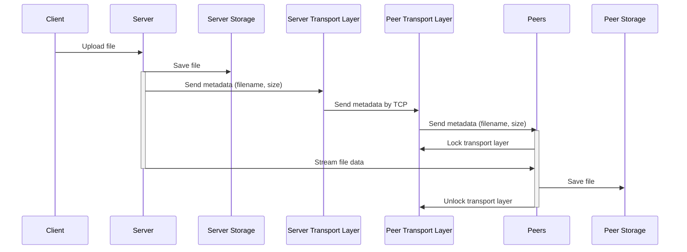
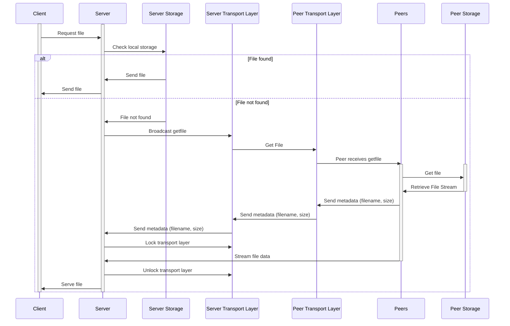

# Go-Distributed-FS

Go-DFS is a distributed file system written in golang. The system has the capability to store, retrieve and delete files from local store and also from network. The synchronizations are done in the background with gossip protocol and is eventually consistent. So this is a AP system (from CAP theorem).

## Project Details
### Network layer
The system builds on top of TCP transport layer. The session, connections are managed by the system. 

### Storage
The files are stored in the local file system with the help of a store encapsulation. The storage supports 5 main functionalities
- Check existence of a file
- Store a file
- Retrieve metadata of a file
- Retrieve a file
- Delete a file

### Gossip protocol
To decrease the load on a single node, the synchronization between network is done through gossip protocol or epidemic protocol. When a file is uploaded to any single node, it sends the file to a randomly selected number of peers which in turn send to some other peers. This everntually makes the system consistent. Accroding to CAP theorem, the system is not immediately consistent but available and parition tolerant.


### Peer discovery
Peer discovery in system is also done by gossip. When a new node joins the cluster it needs to join through a known peer already in the cluster. That known peer sends the peer joining information to the rest of the cluster.

## How to run
### Prequisites
Make sure you have golang installed in your device. Download and install golang from [here](https://go.dev/doc/install)

### Installation
At first clone this repository and then download the dependencies for the project
```bash
git clone https://github.com/TamimEhsan/go-dfs.git
cd go-dfs
go install .
```

### Running the nodes
The servers take 1 mandatory argument <host:port> and optional arguments <addr:port> of the peers. The first node in the system doesn't need any peer address cause there aren't any. The subsequent nodes need at least one remote address to join the network
```bash
go run . 127.0.0.1:4001 # run the first node
go run . 127.0.0.1:4002 127.0.0.1:4001 # run the second node
```
You can add as much number of nodes you want
## Sequence Diagrams
### Saving a file

### Get a file through network


## Acknowledgement
The project is built on top of the tutorial by [Anthony](https://github.com/anthdm) and further modification and new features were added. 