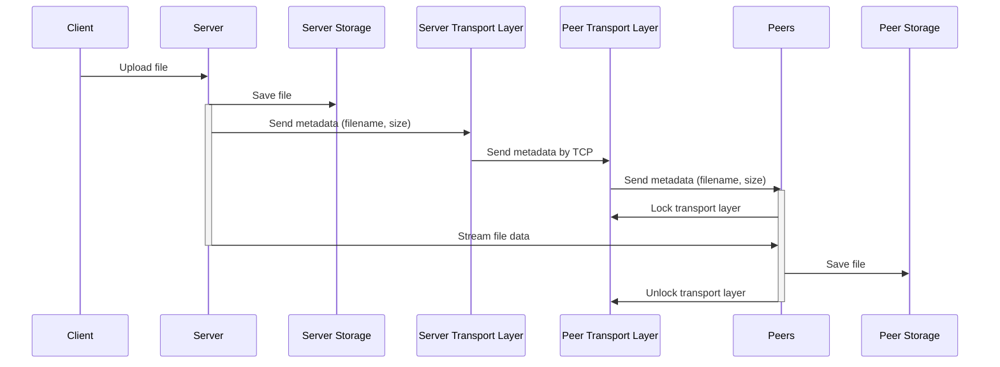
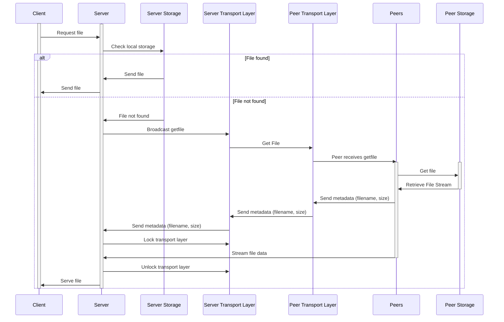

# Go-Distributed-FS

Progress so far
- Create a server which listens to port 4000
- Handle incoming message from telnet
- Write and read from file
- Configure server
- Establish network of nodes
- broadcast data to network
- Prepare for recieving and sending file streams
- Save file recieved from network
- Get and serve non local file from network
- Fix streaming for file contents
- Remove peers after closing

## Sequence Diagrams
### Saving a file

### Get a file through network

